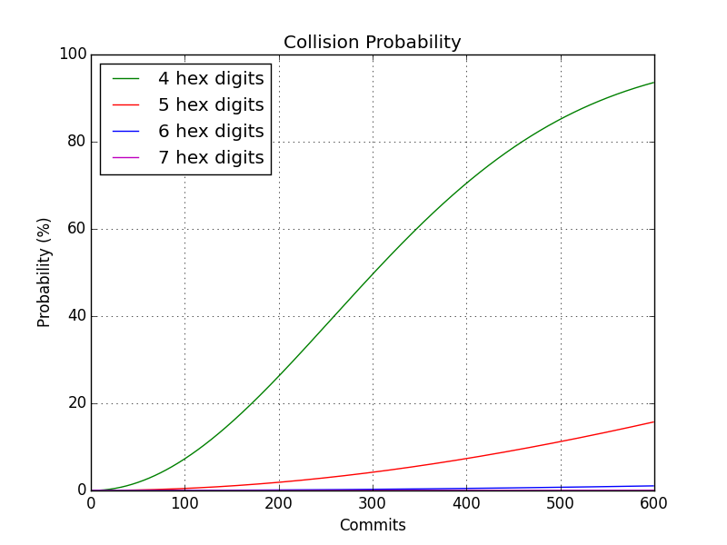
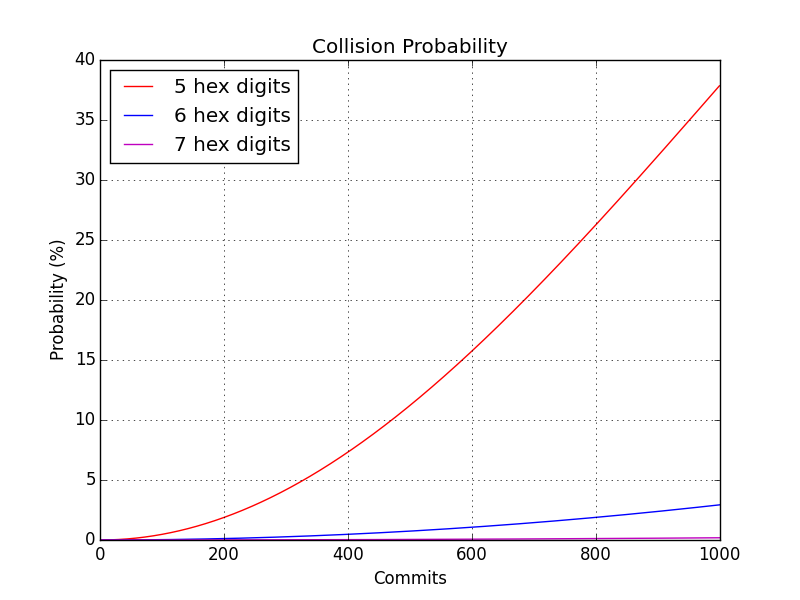
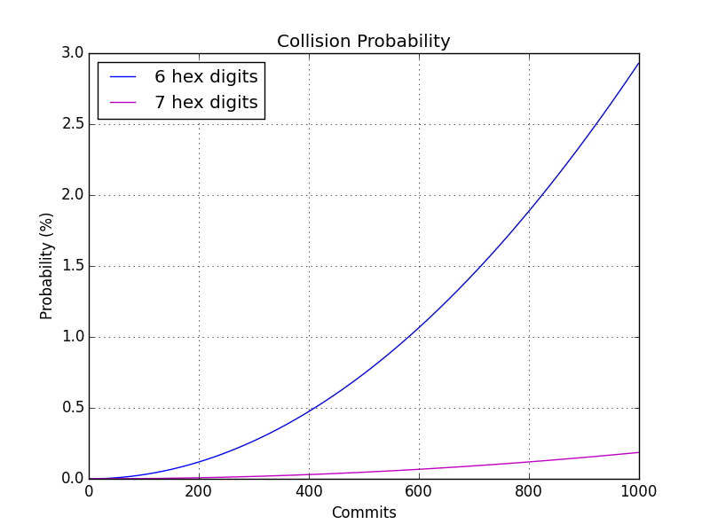
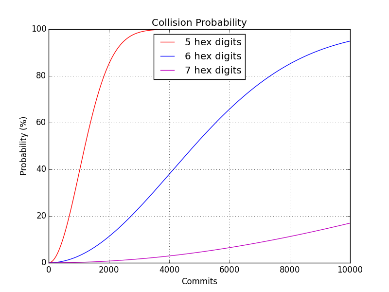

# Git Hash Digits #

Do you ever have discussions with your colleagues about how many
Git hash digits should be used to reference Git commits within your
Git repository?

The probability of a commit hash collision, of course, depends on the
number of digits you track and the number of commits you expect.
(Note: I’m talking about colliding on the first few digits you track, not
the entire SHA1 hash of 40 hex digits).

I used to use 5 digits, but now I use 6.  Some people caution that
I should be using 7.  So I decided to crank the data.  I used the
standard formula for choosing r items from n items without
replacement.  I’d display it here, but I don’t know how to display
math formulas on web pages.

## 500 Commits ##

If you’re expecting a small project at around 500 commits, the
diagram below illustrates the probability of a commit collision using
4-, 5-, 6-, and 7-hex digit hash references.

You can see that even for fewer than 100 commits, the 4-hex-digit
scheme has a significant probability of a collision.  You may be OK
with 5 hex-digits for less than 100.

## 1,000 Commits ##

If you’re expecting closer to 1,000 commits, you’ll definitely want
more than 5 hex digits.  And even for 6 digits the likelihood of a
collision is not trivial.

We can see the 6- and 7-digit data better if we remove the 
5-digit data.

We can see the 6-digit labels approaching a 3% chance of at least
one collision before reaching 1,000 commits.  A 7-digit label still
has less than a quarter of a percent.

These graphs are great fun.  I’ll leave you with a final one that
shows the probability of at least one collision for up to 10,000
commits!

Even for 7-digits the collision likelihood approaches 18%.
